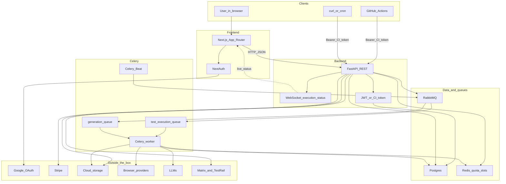

# System overview

Scriptless is two apps plus a few supporting services. The browser talks to the **frontend**. The frontend talks to the **backend**. The backend stores data, starts work, and talks to browsers and LLMs.

## Full architecture

People and CI talk to the website or the API. The API writes to Postgres, checks slots in Redis, and hands long work to Celery over RabbitMQ. Workers drive browsers and LLMs. Live status comes back over a WebSocket.

## The boxes

**Next.js (frontend)**  
Pages, login (NextAuth: email or Google), and the dashboard. It calls the API and listens for live status. Server state is mostly TanStack Query; a little UI state is Zustand.

**FastAPI (backend)**  
HTTP and WebSockets. Routes validate the request, then services do the work and CRUD talks to the database. Models are SQLModel; request/response shapes are Pydantic schemas.

**Postgres**  
Users, orgs, projects, test cases, releases, executions, CI tokens, and the rest.

**RabbitMQ + Celery**  
A browser run can take a long time. The API does not sit and wait. It enqueues work; a Celery worker claims it and drives the browser. Celery Beat also fires due schedules.

**Redis**  
Not the task broker. It holds **quota / slot** counters so we do not start more concurrent executions than the org or the platform allows.

**Browsers and LLMs**  
Workers open a browser (local Playwright or a hosted provider) and ask an LLM when the agent needs to decide a step or a verdict. Providers are configured per environment.

**Also on the diagram**  
NextAuth + Google for login. Stripe for billing. Cloud storage (GCP) for videos and similar files. Matrix and TestRail for import. Two Celery queues: executions vs test generation. GitHub Actions and curl hit the API with a CI token, not the website.

## Live updates

While a run is in progress, the backend can push status over a **WebSocket**. The Executions UI updates without a full refresh.

## Why this shape

The API stays snappy. Heavy work lives in workers. The database is the source of truth; Redis is a short-lived limiter; the queue is the handoff.

## Next

Where this lives in git: [Repo map](03-repo-map.md).
